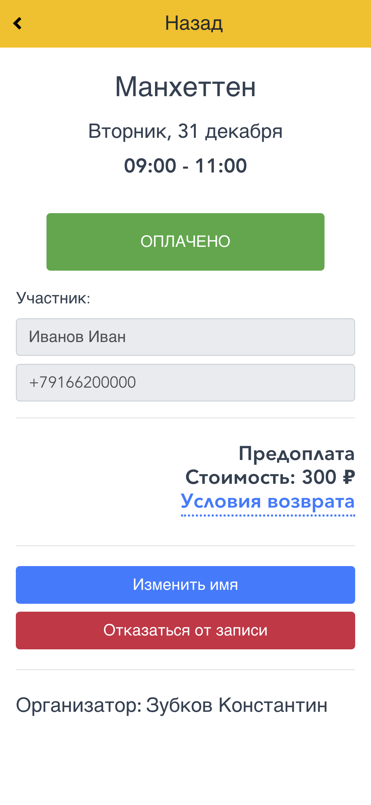

# Basketball Booking Platform 🏀


Платформа для бронирования баскетбольных игр и организации тренировок.
Проект состоит из клиентского веб-приложения (frontend) и серверного API (backend) с интеграцией Telegram и Twilio.

## 🏗 Краткий обзор проекта

Проект разделен на две основные части: **Frontend** и **Backend**. Для более детальной информации об архитектуре, подходах к разработке и тестированию каждой из частей, пожалуйста, обратитесь к соответствующим документам:

*   👉 **[Frontend Документация (Клиентская часть)](front/README.md)**
*   👉 **[Backend Документация (Серверная часть)](back/README.md)**

### 💻 Frontend (`/front`)
Клиентская часть реализована в виде Single Page Application (SPA).
* **Фреймворк:** Vue.js (v2)
* **Роутинг и стейт-менеджмент:** Vue Router, Vuex
* **Стилизация:** Bootstrap Vue

### ⚙️ Backend (`/back`)
Серверная часть предоставляет REST API и обрабатывает логику работы приложения, включая автоматизацию платежей и уведомлений.
* **Среда выполнения:** Node.js (v20)
* **База данных:** SQLite3
* **Интеграции:** Telegram Bot API, Twilio, внутренний шлюз PayProxy

## 🚀 Быстрый запуск

### Запуск через Docker
Вы можете запустить всё приложение (Frontend + Backend) локально с помощью готового Docker образа из GitHub Container Registry (GHCR).

1. Создайте папку `data` в корне проекта и скопируйте туда настройки:
```bash
mkdir -p data
cp docs/settings.jsonc data/settings.json
```
2. Откройте `data/settings.json` и заполните свои ключи. 
   > ⚠️ **Важно для Telegram-бота:** Обязательно укажите свой публичный домен (URL) в `config.telegram.webhookUrl` в файле настроек (например, `https://my-basket-app.com`). Бот использует Webhook-интеграцию, и сервер Telegram будет присылать входящие сообщения прямо на ваш API по этому адресу. Прописывать порт сервера или путь к базе данных **необязательно** — Docker сам переопределит их через переменные окружения.
3. Запустите контейнер (образ скачается автоматически). Если вы используете не amd64, сначала задайте переменную окружения `ARCH=arm64`:
```bash
docker-compose up -d
```

- Приложение будет доступно на `http://localhost:3001` (порт по умолчанию).
- Файл базы данных (`basket.db`) будет автоматически создан внутри папки `data/`.
- Контейнер включает встроенный healthcheck (проверяет статус БД через `/api/status`).

### Создание и публикация Docker образа
Чтобы самостоятельно собрать и загрузить образ в GitHub Container Registry с явным указанием архитектуры (например, `amd64` для большинства серверов или `arm64` для процессоров на базе ARM/Apple Silicon), выполните следующие шаги:

1. Авторизуйтесь в GHCR (потребуется [Personal Access Token (PAT)](https://docs.github.com/en/authentication/keeping-your-account-and-data-secure/managing-your-personal-access-tokens) с правами `read:packages` и `write:packages`):
```bash
echo $CR_PAT | docker login ghcr.io -u ВАШ_GITHUB_USERNAME --password-stdin
```
2. Выберите нужную архитектуру и соберите Docker образ. Флаг `--platform` гарантирует, что образ будет собран именно под нее, даже если вы собираете его на Mac M1:
```bash
export ARCH="amd64" # замените на arm64, если сервер на ARM
docker build --platform linux/${ARCH} -t ghcr.io/kzub/basketball2/basketball_app:latest-${ARCH} .
```
3. Загрузите образ в реестр:
```bash
docker push ghcr.io/kzub/basketball2/basketball_app:latest-${ARCH}
```

### Требования для ручного запуска
* Node.js (рекомендуется v20)
* npm

### Запуск Backend-части
1. Создайте конфигурационный файл `settings.json` (инструкция по заполнению: [Создание конфигурационного файла в back/README.md](back/README.md#создание-конфигурационного-файла-settingsjson)).
   > ⚠️ **Важно для Telegram-бота:** Обязательно укажите свой публичный домен в `config.telegram.webhookUrl` в файле настроек (например, `https://my-basket-app.com`). Бот использует Webhook-интеграцию, и сервер Telegram будет присылать входящие сообщения прямо на ваш API по этому адресу.
2. Выполните:
```bash
cd back
npm install
BASKET_MODE=dev npm start # Запускает node server.js в режиме разработки
```

### Запуск Frontend-части
```bash
cd front
npm install --legacy-peer-deps
npm run serve # Запуск dev-сервера с hot-reload
```

## 🛠 Развертывание (Self-Hosting)

Существует два основных способа развертывания проекта: запуск с помощью **Docker Compose** (новый и более простой способ) и классический подход (через **Nginx + Systemd**). Оба варианта полностью поддерживаются.

### Развертывание через Docker
Для запуска с помощью Docker вам достаточно клонировать репозиторий, подготовить папку `./data/` с файлом настроек `settings.json` и запустить:
```bash
docker-compose up -d
```
Докер сам скачает нужный образ приложения с GitHub Container Registry, запустит backend и начнет раздавать статические файлы вместе с API через один порт. Подробнее в разделе [Запуск через Docker](#запуск-через-docker-рекомендуется).

### Классическое развертывание (без Docker)
Для классического развертывания на сервере рекомендуется использовать **Nginx** для отдачи собранной статики фронтенда и проксирования запросов к API, а также **Systemd** для управления процессом Node.js-бекенда.

### Сборка Frontend для Production
Перед развертыванием необходимо собрать оптимизированные статические файлы клиентской части:
```bash
cd front
npm install --legacy-peer-deps
npm run build # Собирает проект в директорию /dist
```
> 💡 **Примечание:** После выполнения этой команды, все скомпилированные статические файлы (HTML, CSS, JS) будут находиться в директории `front/dist`. Именно эту директорию должен раздавать веб-сервер (Nginx) напрямую, как статические файлы, без участия Node.js.

### Примеры конфигураций
Мы подготовили шаблоны конфигураций в папке `docs`:
*   📄 **[Пример конфигурации Nginx](docs/nginx.conf.example)** — настройка домена, раздача собранного frontend из папки `dist` и проксирование запросов к backend.
*   📄 **[Пример сервиса Systemd](docs/systemd.service.example)** — запуск backend (Node.js) в качестве фонового демона с автоматическим перезапуском при падении.

### Рекомендуемая схема развертывания (Prod & Dev на одном сервере)
Бэкенд поддерживает полноценную работу всех интеграций (включая Telegram-ботов и платежные системы) даже в режиме разработки (`BASKET_MODE=dev`).

Для безопасного обновления системы рекомендуется держать на production-сервере сразу две версии приложения:
1. **Dev (Staging) версия** (`BASKET_MODE=dev`): Используется для тестирования новых фич и проверки интеграций на реальном сервере.
2. **Prod версия** (`BASKET_MODE=prod`): Основная стабильная версия для конечных пользователей.

**Процесс обновления:**
Новые версии кода сначала нужно выкатывать на **dev** версию. Только после того как вы убедитесь, что на сервере всё работает штатно (проходят платежи, приходят уведомления от бота), проверенный код перекладывается в **prod** версию.

**Как это реализовать:**
1. Склонируйте проект в две разные директории на вашем сервере (например, `/opt/basketmsk/` для продакшена и `/opt/basketmsk.dev/` для дев-версии).
2. Настройте два разных сервиса Systemd (один с `BASKET_MODE=prod`, другой с `BASKET_MODE=dev`).
3. В конфигурационных файлах `settings.json` для каждого окружения укажите разные порты (например, `3001` для prod и `3002` для dev).
4. Настройте Nginx, создав два виртуальных хоста, которые будут проксировать запросы на соответствующие порты (например, `basket.msk.ru` -> `3001` и `dev.basket.msk.ru` -> `3002`).

## 📸 Скриншоты и интерфейс

Приложение разделено на интерфейсы для **игроков** и **администраторов (организаторов)**.

### Интерфейс игрока

| Список игр | Экран игры | Мои платежи | Бронирование |
|:---:|:---:|:---:|:---:|
|  |  |  |  |

### Интерфейс организатора (Админка)

| Управление играми | Создание игры | Прошлые игры |
|:---:|:---:|:---:|
|  |  |  |
