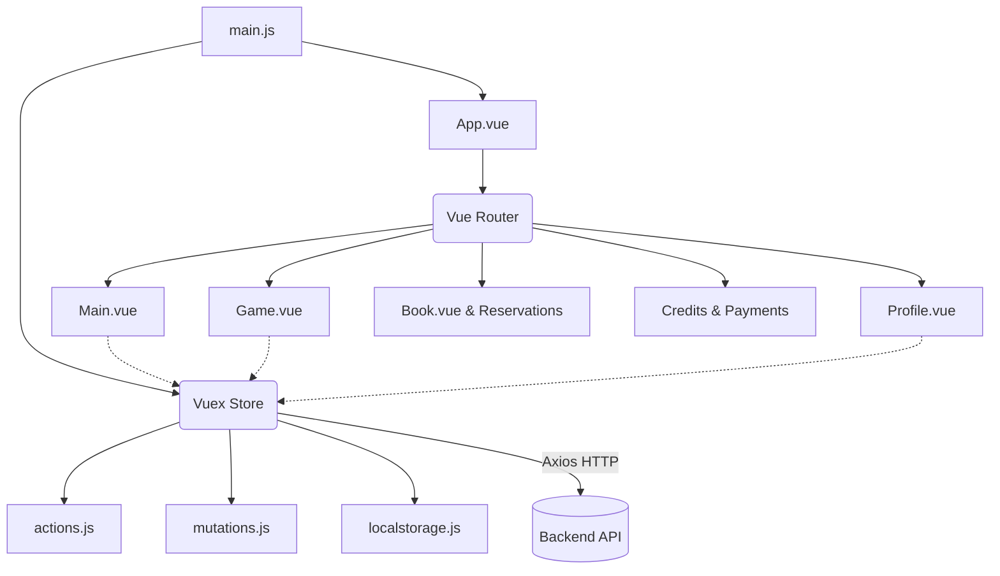

# Basketmsk Frontend (basketfront2)


Single Page Application (SPA), спроектированное в первую очередь для мобильных устройств (mobile-first), предназначенное для управления расписанием баскетбольных игр, бронирования мест игроками, отслеживания кредитов/платежей и администрирования игр. Приложение адаптировано для мобильных экранов (максимальная ширина экрана ограничена 500px в корневых стилях).

## 📋 Оглавление
1. [Обзор](#обзор)
2. [Технологический стек](#технологический-стек)
3. [Архитектура и структура проекта](#архитектура-и-структура-проекта)
4. [Ключевые функции и компоненты](#ключевые-функции-и-компоненты)
5. [Требования](#требования)
6. [Локальная разработка](#локальная-разработка)

---

## Обзор

**Basketmsk** — это полнофункциональная платформа для бронирования и управления любительскими баскетбольными играми. Игроки могут просматривать предстоящие игры, бронировать места, передавать свои брони другим, оплачивать игры (или использовать накопленные кредиты) и следить за своей личной игровой статистикой. Администраторы имеют расширенные права для создания игр, проведения расчетов, закрытия записи и управления возвратами/кредитами.

## Технологический стек

Приложение было недавно модернизировано для полной поддержки окружений Node 20+, при этом сохраняя стабильность работы с устаревшими зависимостями.

* **Основной фреймворк**: Vue.js v2.7 (Последний релиз Vue 2 с поддержкой Composition API)
* **Сборщик**: Vue CLI 5 (Webpack 5)
* **Управление состоянием**: Vuex 3
* **Маршрутизация**: Vue Router 3
* **Библиотека UI**: BootstrapVue (Bootstrap 4)
* **HTTP клиент**: Axios
* **Интеграция карт**: `vue2-google-maps`

## Архитектура и структура проекта

Проект следует стандартному шаблону архитектуры Vue CLI, но использует немного нестандартную инициализацию маршрутизатора (роутера) внутри `App.vue`.

### Структура директорий

```text
├── deploy.sh               # Bash-скрипт для деплоя с использованием rsync
├── public/                 # Статичные публичные ассеты (index.html, favicon)
├── src/                    # Исходный код приложения
│   ├── assets/             # Изображения, глобальные CSS стили
│   ├── components/         # Страницы и переиспользуемые Vue компоненты
│   ├── mixins/             # Общая логика Vue компонентов (миксины)
│   ├── store/              # Управление состоянием Vuex (actions, mutations, localstorage)
│   ├── App.vue             # Корневой компонент и конфигурация Vue Router
│   └── main.js             # Точка входа в приложение и инициализация плагинов
├── babel.config.js         # Пресеты Babel (формат Vue CLI 5)
├── vue.config.js           # Оптимизация Webpack и пользовательские настройки
└── package.json            # Зависимости проекта и скрипты
```

### Диаграмма высокоуровневой архитектуры



### Маршрутизация и управление состоянием

* **Маршрутизация (Routing)**: Маршруты приложения полностью определены в `src/App.vue`. Он связывает URL-адреса (например, `/book`, `/game`, `/profile`) с соответствующими компонентами внутри `src/components/`. Роутер активно использует компоненты Vue `<transition>` для анимации скольжения между экранами, имитируя поведение нативного мобильного приложения.
* **Состояние (Vuex)**: Централизованное управление состоянием находится в `src/store/`.
  * `actions.js`: Отвечает за выполнение асинхронных вызовов Axios к бэкенду и передачу данных (commit).
  * `mutations.js`: Отвечает за синхронное обновление дерева состояний на основе результатов действий (actions).
  * `localstorage.js`: Помогает сохранять определенные состояния приложения (например, токены или активные сессии) в `localStorage` браузера.

## Ключевые функции и компоненты

* **Дашборд и Главный экран (`Main.vue`)**: Отображает список предстоящих игр и основные параметры навигации.
* **Управление играми (`Game.vue`, `GameNew.vue`, `GameNewCopy.vue`)**: Интерфейсы для просмотра деталей игры, времени начала, списков игроков, а также для создания совершенно новых игр или копирования существующих (для Администраторов).
* **Процесс бронирования (`Book.vue`, `Reservation.vue`, `BookTransfer.vue`)**: Основной процесс резервирования места на игру. Обрабатывает различные роли игроков и позволяет передавать бронь другим игрокам.
* **Аккаунты пользователей и Аутентификация (`Profile.vue`, `RegisterBySms.vue`, `RegisterByTG.vue`)**: Управление профилями пользователей, именами и методами аутентификации, включая интеграцию с SMS и Telegram.
* **Платежи и Кредиты (`MyCredits.vue`, `Credits.vue`, `GamePayments.vue`, `FreePayment.vue`)**: Модули, посвященные управлению виртуальным балансом, обработке возвратов и отметке игр как оплаченных.
* **Статистика (`MyStats.vue`)**: Специфичная для игрока аналитика и историческая эффективность.
* **Интеграция с картами (`MapView.vue`)**: Использует Google Maps для отображения мест проведения игр.

## Требования

Для локального запуска проекта убедитесь, что у вас установлено следующее:
* **Node.js**: `>= 20.0.0` (Рекомендуется: `v20.x` LTS)
* **npm**: `>= 10.0.0`

## Локальная разработка

1. **Клонируйте репозиторий:**
   ```bash
   git clone <repository_url>
   cd repo_name/front
   ```

2. **Установите зависимости:**
   Проект настроен так, чтобы корректно устанавливаться без конфликтов устаревших зависимостей.
   ```bash
   npm install --legacy-peer-deps
   ```

3. **Запустите сервер для разработки:**
   Эта команда компилирует приложение с включенной горячей перезагрузкой (hot-reload).
   ```bash
   npm run serve
   ```
   *Примечание: Убедитесь, что ваше локальное окружение перенаправляет `basket.host` на `127.0.0.1` в файле `hosts` вашей системы, так как скрипт запуска использует флаг `--host basket.host`.*

4. **Линтинг и Автоформатирование:**
   Проверьте качество кода с помощью настроенных правил ESLint:
   ```bash
   npm run lint
   ```

5. **Сборка для продакшена:**
   Скомпилируйте и минифицируйте проект для развертывания на рабочем сервере.
   ```bash
   npm run build
   ```
   Скомпилированные файлы будут помещены в директорию `dist/`.